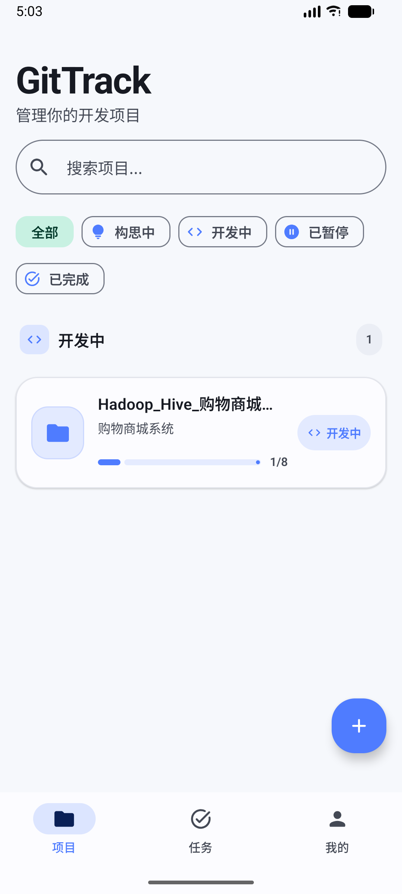
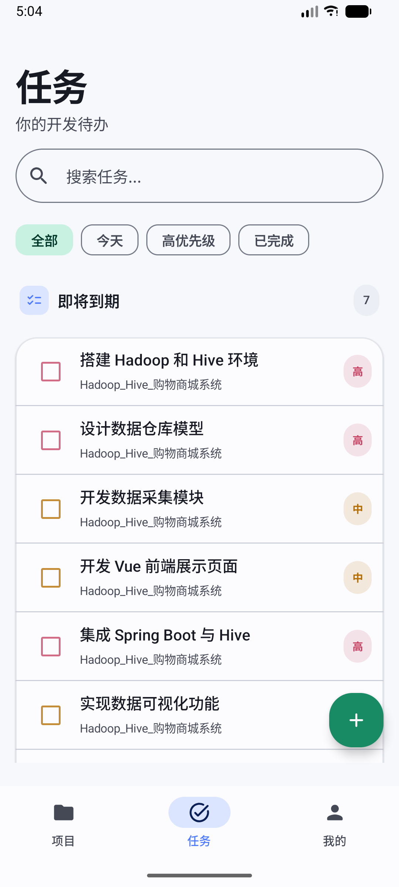
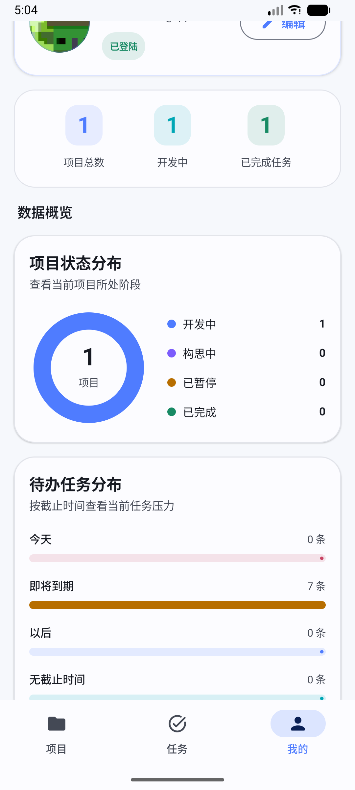
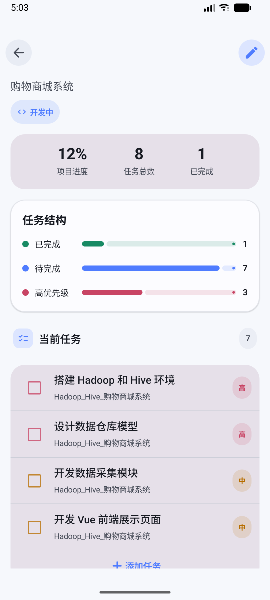
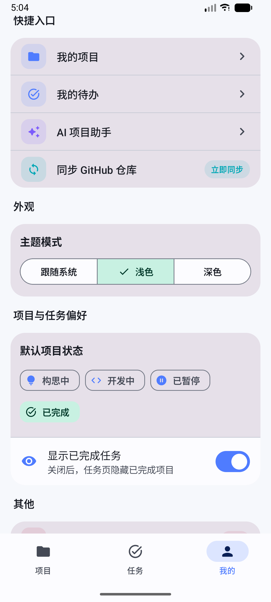

# GitTrack

## 项目简介

GitTrack 是一个基于 Kotlin 和 Jetpack Compose 开发的 Android 项目管理应用。
它主要面向开发者和学生，用于记录开发项目、管理任务进度、查看项目统计，并支持 GitHub 仓库信息同步和 AI 辅助任务拆分。

项目采用 Material 3 风格设计，界面简洁清爽，支持本地登录、项目管理、任务管理、数据统计、主题切换和本地头像选择等功能。

------

## 应用截图

> <p align="center">
> 
> 
> 
> 
> 
> </p>


------

## 主要功能

- 项目创建、编辑、查看与删除
- 任务创建、分类、完成状态管理
- 项目进度统计与任务完成情况展示
- 本地登录与注册功能
- 我的页面个人资料管理
- 支持从本地选择头像
- 支持浅色、深色和跟随系统主题
- GitHub 仓库信息同步
- AI 辅助生成项目任务
- Room 本地数据库持久化存储
- DataStore 保存用户偏好设置

------

## 技术栈

- Kotlin
- Jetpack Compose
- Material 3
- Navigation Compose
- Room
- DataStore
- Retrofit / OkHttp
- Coil Compose
- Coroutines / Flow
- MVVM 架构

------

## 配置项目

### 1. 下载项目

```bash
git clone https://github.com/<你的GitHub用户名>/GitTrack.git
cd GitTrack
```

### 2. 配置 Android SDK

项目根目录创建或修改：

```text
local.properties
```

加入：

```properties
sdk.dir=/你的/Android/Sdk
```

macOS 示例：

```properties
sdk.dir=/Users/你的用户名/Library/Android/sdk
```

### 3. 配置 Qwen

在 `local.properties` 中继续加入：

```properties
DASHSCOPE_API_KEY=你的阿里云百炼API_KEY
QWEN_MODEL=选择你的模型
DASHSCOPE_BASE_URL=https://dashscope.aliyuncs.com/compatible-mode/v1/
```

新加坡国际地域可以使用：

```properties
DASHSCOPE_BASE_URL=https://dashscope-intl.aliyuncs.com/compatible-mode/v1/
```

---

## 运行项目

### 1. Android Studio

1. 用 Android Studio 打开项目根目录；
2. 在 Gradle 设置中选择 JDK 17；
3. 等待 Gradle Sync 完成；
4. 创建 Android 模拟器或连接真机；
5. 运行 `app`。

### 2. 命令行构建

macOS / Linux：

```bash
./gradlew clean
./gradlew assembleDebug
```

Windows：

```powershell
gradlew.bat clean
gradlew.bat assembleDebug
```

生成的 Debug APK 通常位于：

```text
app/build/outputs/apk/debug/app-debug.apk
```

执行单元测试：

```bash
./gradlew test
```

---

## 查看 Room 数据库

运行 App 后，在 Android Studio 中打开：

```text
View
→ Tool Windows
→ App Inspection
→ Database Inspector
```

选择 GitTrack 进程，再打开：

```text
gittrack.db
```

可以查看：

- projects
- tasks
- github_cache

常用 SQL：

```sql
SELECT * FROM projects;
SELECT * FROM tasks;
SELECT * FROM github_cache;
```

## 项目结构

```text
GitTrack
    ├── app
    │   ├── build
    │   │   ├── generated
    │   │   ├── intermediates
    │   │   ├── kotlin
    │   │   ├── kspCaches
    │   │   ├── outputs
    │   │   └── tmp
    │   ├── build.gradle.kts
    │   ├── schemas
    │   │   └── com.example.gittrack.data.local.GitTrackDatabase
    │   └── src
    │       └── main
    ├── bootstrap-gradle-wrapper.command
    ├── build.gradle.kts
    ├── gradle
    │   └── wrapper
    │       └── gradle-wrapper.properties
    ├── gradle.properties
    ├── gradlew
    ├── gradlew.bat
    ├── local.properties
    ├── local.properties.example
    ├── README.md
    ├── screenshots
    │   ├── detail.png
    │   ├── me_1.png
    │   ├── me.png
    │   ├── projects.png
    │   └── tasks.png
    └── settings.gradle.kts
```